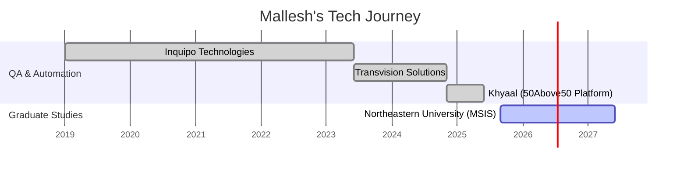

<!-- ⚡ MALLLESH MALLIKARJUNAIAH – NEON MATRIX README ⚡ -->

<h1 align="center">
  
</h1>

  
  
  

---

### ⚡ About Me  
💡 *Turning QA precision into developer creativity.*  
🎓 **MS in Information Systems @ Northeastern University, Boston**  
💻 Former **QA Engineer → Emerging Full-Stack Developer**  
☁️ Passionate about **React, Node.js, Azure, MySQL, and REST APIs**  
🎯 2026 Goal → Secure a **Software Developer Co-op / Internship**  
🎬 Motto: _“Code. Test. Learn. Repeat.”_  

---

## 🧠 Tech Universe  

  

---

## 🌈 My “Skill Spectrum”

| Skill Domain | % Proficiency | Core Tools |
|---------------|---------------|-------------|
| **Frontend Development** | 🟩🟩🟩🟩⬜ 80% | React.js, HTML, CSS, JS |
| **Backend + APIs** | 🟩🟩🟩⬜⬜ 70% | Node.js, Express, REST |
| **Automation Testing** | 🟩🟩🟩🟩🟩 95% | Selenium, RestAssured, TestNG |
| **Data / Analytics** | 🟩🟩🟩⬜⬜ 65% | Python, MySQL, Power BI |
| **Cloud & DevOps** | 🟩🟩🟩⬜⬜ 60% | Azure, GCP, GitHub Actions |

---

## 🧩 Projects Dashboard  

| 🚀 Project | 💡 Description | 🧠 Tech Stack |
|-------------|----------------|----------------|
| 🎓 [EduTrack AI](https://github.com/Mallesh-Mallikarjunaiah/EduTrack-AI) | AI-driven school management for attendance & grades | Java · Swing · MySQL · Azure |
| 🍔 [City Bites Boston](https://github.com/Mallesh-Mallikarjunaiah/City-Bites) | Restaurant guide with dynamic filters & open-now toggle | HTML · CSS · JS · Bootstrap |
| 🐄 [Cattle Feed Dashboard](https://github.com/Mallesh-Mallikarjunaiah/CattleFeed-Analytics) | IoT analytics dashboard for cattle monitoring | Python · MySQL · Power BI · Azure |

---

## 🧮 GitHub Insights  

  
  

  

---

## 📈 Neon Contribution Graph  

  

---

## 🌍 Global Visitor Map (Countries & Flags)

  

---

## 🧊 3D Contribution Cube (Animated Calendar)

  

---

## 🧭 Professional Timeline  

---

## 🌌 “Neon Signature” Quote  

  

---

## 💬 Connect with Me  

  
  
  
  

---

<h3 align="center">⭐ Crafted with 💻 & ⚡ by Mallesh Mallikarjunaiah</h3>

  

