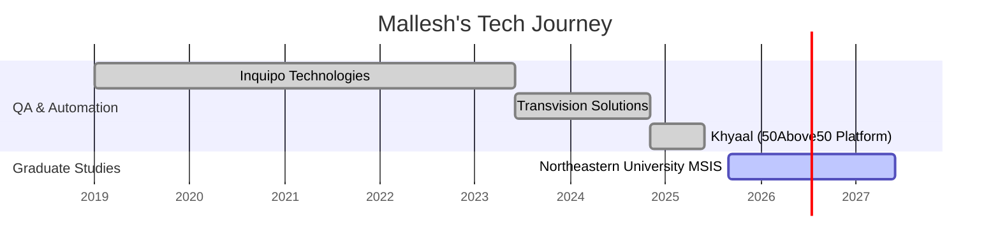

<!-- ⚡ MALLLESH MALLIKARJUNAIAH – NEON MATRIX README ⚡ -->

<div align="center">

<!-- Neon Cyberpunk Header -->


<!-- Typing Effect -->


<!-- Links -->
<p align="center">
  <a href="https://mallesh-tech-folio.online"></a>
  <a href="https://www.linkedin.com/in/malleshmallikarjunaiah"></a>
  <a href="mailto:malleshmallikarjunaiah@gmail.com"></a>
</p>

📍 **Boston, MA | Software Developer Co-op / Internship – 2026**

</div>

---

## 🧠 About Me — *Neon Matrix Edition*

```ts
const mallesh = {
  role: "Full-Stack Developer | QA Engineer",
  education: "MS in Information Systems @ Northeastern University",
  experience: "5+ years in QA & Automation",
  focus: ["React", "Node.js", "Java", "REST APIs", "Azure"],
  mindset: "Quality-first engineering",
  motto: "Code. Test. Learn. Repeat."
};
```

---

## 🧠 Tech Stack & Tools

<p align="center">
  
</p>

---

## 🌈 My “Skill Spectrum” (Progress View)

```diff
Frontend Development     ████████████▓░░░░ 85%
Backend & APIs           █████████▓░░░░░░░ 70%
Automation Testing       ███████████████░░ 95%
Data / Analytics         ████████▓░░░░░░░░ 60%
Cloud & DevOps           ███████▓░░░░░░░░░ 55%
UI/UX Design             ████████▓░░░░░░░░ 65%
```

---

## 🎓 Academic Projects — Northeastern University

### 🏥 CareLink360 — Healthcare Management Ecosystem  
**Course:** INFO 5100 – Application Engineering & Development (AED)  
**Tech:** Java · Java Swing · DB4O · MVC · OOP  

- Role-based dashboards (Doctor, Patient, Insurance, Admin)
- WorkQueue-driven healthcare workflows
- Insurance claim processing & approvals
- Enterprise-level architecture modeling

**My Role**
- Java Swing UI panels  
- Business logic & workflows  
- DB4O persistence  
- Clean MVC separation  

🔗 Repo:  
https://github.com/Mallesh-Mallikarjunaiah/Group_15_Final_Project_CareLink_360

---

### 🎓 EduTrack_AI — Education Management Platform  
**Course:** INFO 6150 – Web Design & UX Engineering  
**Tech:** HTML · CSS · JavaScript · Bootstrap  

- Responsive & accessible UI
- UX-first navigation
- Form validations & dashboards

**My Role**
- Frontend UI components  
- Client-side JavaScript logic  
- UX & accessibility improvements  

🔗 Repo:  
https://github.com/Mallesh-Mallikarjunaiah/EduTrack-AI

---

## 🚀 Other Projects

| Project | Description | Tech |
|------|-----------|------|
| 🐄 Cattle Feed Analytics | IoT analytics dashboard | Python · MySQL · Power BI · Azure |
| 🍔 City Bites Boston | Restaurant discovery platform | HTML · CSS · JS · Bootstrap |

---

## 🧮 GitHub Insights

<p align="center">
  
  
</p>

<p align="center">
  
</p>

---

## 📈 Neon Contribution Graph

<p align="center">
  
</p>

---

## 🧊 3D Contribution Matrix

<p align="center">
  
</p>

---

## 🧭 Professional Timeline



---

## 🌌 Neon Signature


---

## 🤝 Connect

- LinkedIn: https://www.linkedin.com/in/malleshmallikarjunaiah  
- Portfolio: https://mallesh-tech-folio.online  
- Email: malleshmallikarjunaiah@gmail.com  
- GitHub: https://github.com/Mallesh-Mallikarjunaiah  

---

<h3 align="center">⚡ Crafted in the Neon Matrix by Mallesh Mallikarjunaiah ⚡</h3>


